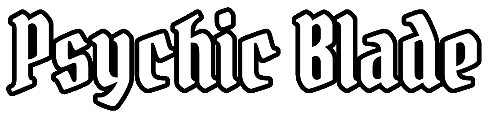
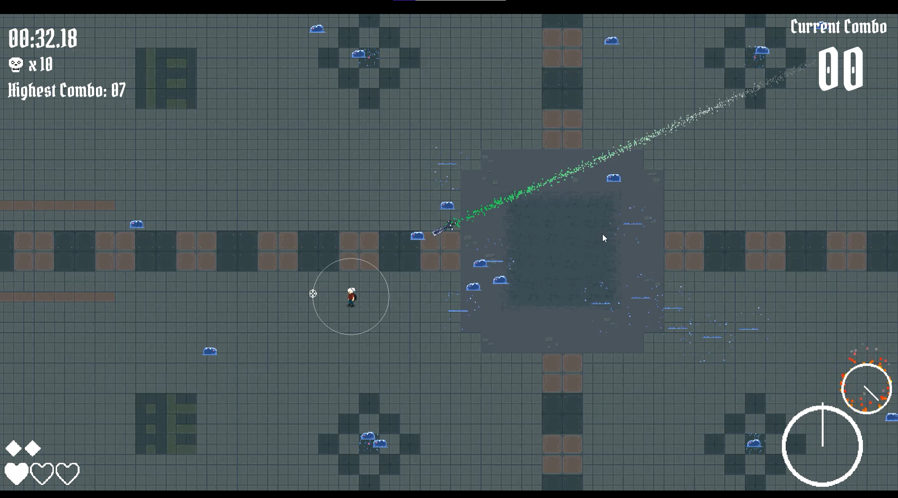
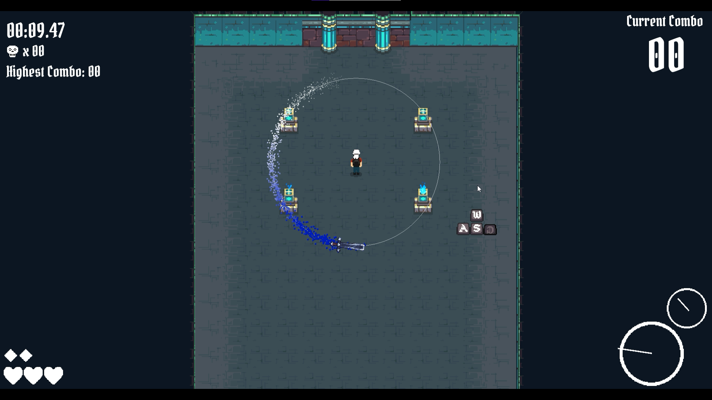
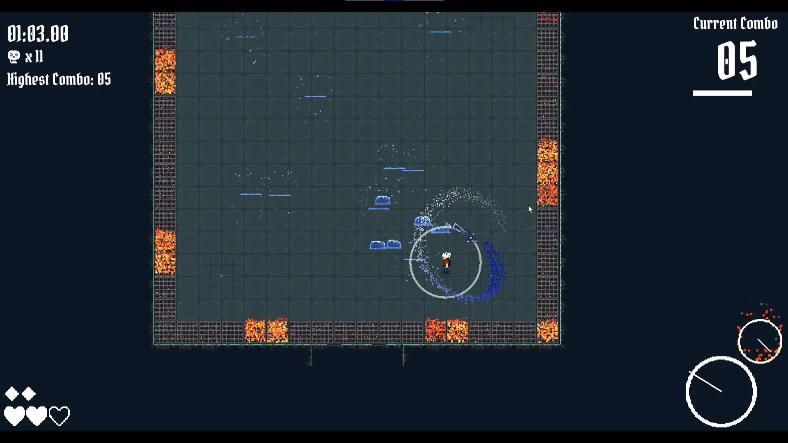

  

# Psychic Blade

## Overview

Psychic Blade is a top down dungeon crawler demo where you play a psychic adventurer who rotates a blade around their body to slay enemies and solve puzzles they encounter in their journey.

Currently the game is only a basic demo of the rotational blade mechanic with some simple levels to test the functionality but I may eventually add more enemies and levels to the game.

I highly recommend first time players play the **Tutorial** level and after that try the **Slime Spawners** level to see how long they can last and how high of a combo they can get!

## Play Psychic Blade

You can download and play Psychic Blade for free on either the [itch.io](https://izook.itch.io/psychic-blade) page or from the `exports.zip` file in our Github [releases](https://github.com/Izook/psychic-blade/releases).

## Screenshots

## Special Thanks

- [Szadi Art](https://szadiart.itch.io/) for providing the assets for the [map](https://szadiart.itch.io/2d-magic-lands-dung1) and the [player](https://szadiart.itch.io/rpg-main-character)
- [Rvros](https://rvros.itch.io/) for providing the assets for the [slime enemy](https://rvros.itch.io/pixel-art-animated-slime)
- [Snabisch](https://snabisch.itch.io/) for providing [background music](https://snabisch.itch.io/sixty-minutes-free-music) throughout the game
- [SoupTonic](https://twitter.com/soup_tonic) for providing the [UI sound effects](https://souptonic.itch.io/souptonic-sfx-pack-1-ui-sounds)
- [SGB Games](https://sfbgames.com/) for providing [ChipTone](https://sfbgames.itch.io/chiptone) which was used to create a lot of the sound effects
- [TheWiseHedgehog](https://twitter.com/thewisehedgehog) for providing the assets for the [blade](https://thewisehedgehog.itch.io/hs2020)
- [Hyohnoo](https://twitter.com/Hyohnoo) for providing the [keyboard animations](https://hyohnoo.itch.io/keyboard-controller-keys) in the tutorial
- [Google Fonts](https://fonts.google.com/) for providing the [Pirata One](https://fonts.google.com/specimen/Pirata+One#glyphs) font

## Built Using

